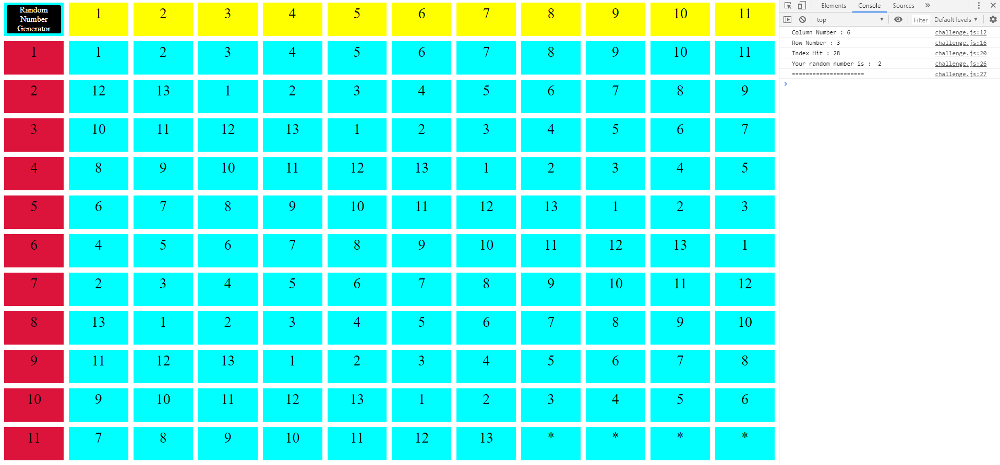

# Call-Em-All Coding Challenge

## Table of Contents

## Thought Process 

In this problem, the first thing that came to mind was how could I utilize rand11 to create a higher random number generator from 1-13. 
I believed a way to solve the problem would be to use the rand11 function twice to find a specific index in a rejection sampling table.
Using rejection sampling would help ensure that the numbers 1-13 has an equal chance of being called to provide a fair random number generator.
I was also thinking of time complexity and figured using rejection sampling can provide an O(1) time complexity solution since we are calling a random number generator twice.

## Design 

View the index.html for the rejection sampling table I created to visualize the solution.  You can click the Random Number Generator button and view the results in the console.
Refer to the PNG and GIF in the images folder for the visual representation if you are unable to view the results in the console within the index.html file.
The yellow boxes are the columns, the crimson boxes are the rows, and the aqua boxes are the indices.

The rejection sampling table contains 11 rows and 11 columns since the rand11 function generates a random number from 1-11. 
Each index contains a number from 1-13, and it increments by 1 from left to right.
 
Since I have 121 indices to work with (11 rows * 11 columns), and 13 is not a multiple of 121, this would create the “dead zone” towards the end of the table. 
The purpose of the “dead zone” is to create a fair chance for 1-13 to be called in this table. 
Looking at the table, if I had continued to fill out the indices, the numbers (1-4) would have a higher chance of being randomly selected. 
 
As I went through the problem, I figured out two ways to determine the total indices of the dead zone. 
If you were to draw out the table, you would realize that after 9 times of writing out 1-13, the 10th iteration would not have enough room. 
To keep the odds fair, you would stop after the 9th iteration and leave the spaces blank (13*9 iterations = 117 filled indices with indices 118-121 left out creating 4 dead spaces). 
Another way to calculate the total amount of dead spaces is by taking 121 modulo 13, which results in 4 dead spaces.
 
Looking at the table I designed, indices 118, 119, 120, and 121 are in the dead zone and symbolized by an asterisk. 
In the rand13 function, if the index hits 118, 119, 120, or 121, I will recall the function again to generate another integer to ensure each number has an equal probability of being returned. 

The solution I generated has an O(1) time complexity on average and an O(infinity) worst-case because there is always a small chance that the found index can be rejected.

## Time To Complete 

1 hour

## Images 

